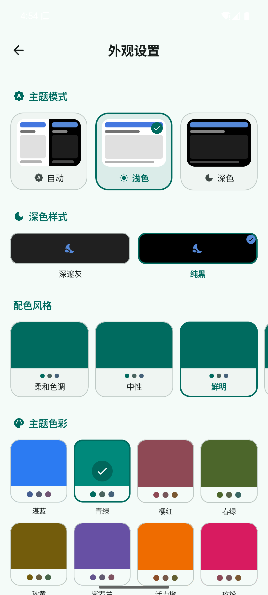
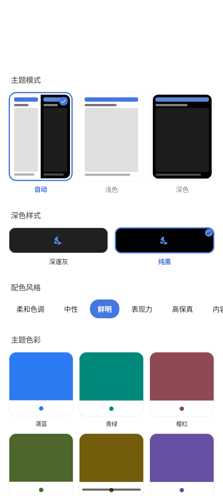
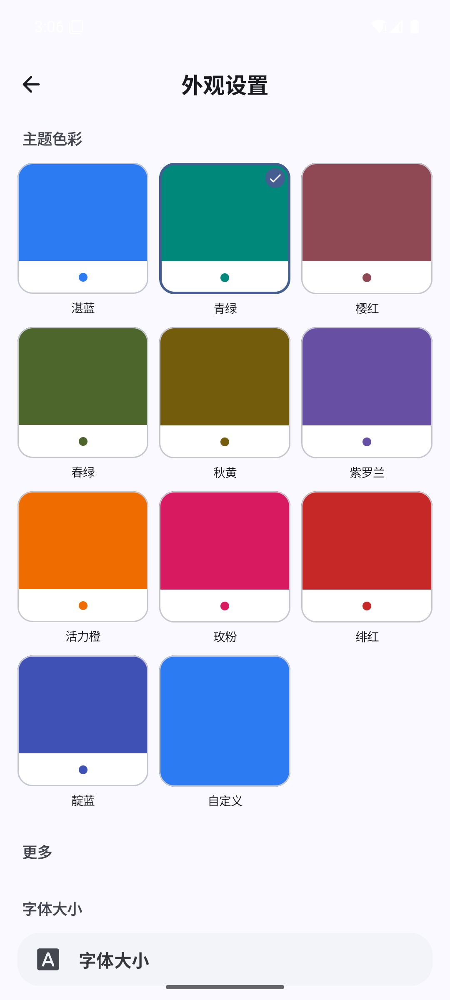
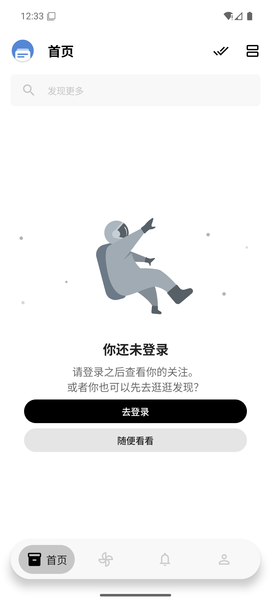
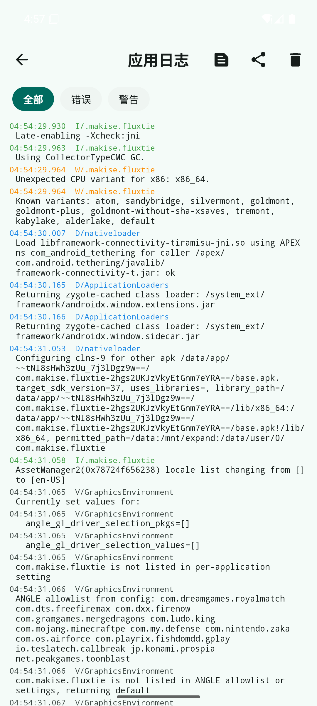

<p align="center">
  
</p>

<h1 align="center">FluxTie</h1>

<p align="center">
  一款 Material 3 风格的<strong>非官方第三方贴吧客户端</strong> — 基于 TiebaLite 深度重构，全新外观体系 · 悬浮底栏 · MD3 动态配色
</p>

<p align="center">
  <a href="https://github.com/makise2060/FluxTie/releases"></a>
  <a href="https://developer.android.com/about/versions/16"></a>
  <a href="https://kotlinlang.org"></a>
  <a href="https://developer.android.com/jetpack/compose"></a>
  <a href="https://developer.android.com/build/releases/gradle-plugin"></a>
  <a href="https://github.com/makise2060/FluxTie/blob/main/LICENSE"></a>
</p>

---

> [!WARNING]
> **本软件及源码仅供学习交流使用，严禁用于商业用途。**

## 📸 预览

| 外观设置 | 配色风格 | 主题色彩 |
|:---:|:---:|:---:|
|  |  |  |
| **悬浮底栏** | **动态页** | **应用日志** |
|  |  |  |

## ✨ 特性

- 🎨 **MD3 动态配色** — 种子色 × 9 种配色风格（柔和色调/鲜明/高保真…）实时生成整套配色，14 款精选预置色板 + 自定义取色，全部即点即生效
- 🌗 **深浅模式** — 浅色 / 深色 / 跟随系统三卡预览；深色样式支持深邃灰与 AMOLED 纯黑
- 🎈 **悬浮胶囊底栏** — 选中胶囊动画 + 触感反馈，Tab 切换交叉淡化过渡，页面状态完整保留
- 📜 **顶栏滚动收起** — 动态页内容上滑自动收起标题栏，双击快速回顶
- 🗂️ **分组卡片式设置** — 对齐 Android 13+ 系统设置观感的分组卡片体系，全局 Material 3 开关组件
- 📋 **应用日志** — 内置日志查看器，级别过滤 / 一键复制 / 分享，问题反馈更高效
- 💬 **完整贴吧能力** — 首页 / 动态（关注·推荐·热榜）/ 通知 / 我的，看贴回贴、一键签到等原版功能全部保留

## 🚀 相对原版的升级

本项目 Fork 自 [TiebaLite](https://github.com/zzc10086/TiebaLite)，在原版基础上完成了一次系统的现代化改造：

### 🎨 主题引擎重做
| 原版 | FluxTie |
|---|---|
| 固定主题名列表（清新蓝/少女粉…） | **MD3 种子配色**：种子色 × 配色风格动态生成整套色板 |
| Material You 动态取色（仅 Android 12+） | MaterialKolor 引擎，全版本可用 |
| 选色后部分效果需重启 | 全部即时生效，设置页所见即所得 |

### 🛠️ 工具链升级
| 组件 | 原版 | FluxTie |
|---|---|---|
| Android Gradle Plugin | 8.13.2 | **9.4.0**（内置 Kotlin 支持） |
| Gradle | 8.14.5 | **9.7.1** |
| compileSdk / targetSdk | 36 | **37** |
| Hilt | 2.58 | **2.60** |
| 配色引擎 | — | **MaterialKolor 5.0.1** |

### 🧹 细节打磨
- 启动屏：系统 splash → 品牌页（blob 动画）无缝衔接，深浅色自适应
- 帖子流去除生硬分隔线，改为留白分隔；悬浮底栏贴平质感
- 权限弹窗统一新图标；状态栏字体颜色随明暗模式正确切换
- KSP 全链路构建，Java 17 目标，`FluxTie-v{版本}-{渠道}.apk` 规范命名

## 📥 下载

前往 [**Releases**](https://github.com/makise2060/FluxTie/releases) 下载最新 APK，或自行构建（见下）。

> [!NOTE]
> 本包名（`com.makise.fluxtie`）与原版 TiebaLite 不同，可作为独立应用安装，互不影响。

## 🛠️ 技术栈

| 层 | 技术 |
|---|---|
| 语言 | **Kotlin 2.3** · Java 17 |
| UI | **Jetpack Compose**（Material 组件 + 自研 M3 风格组件库） |
| 主题 | **MaterialKolor 5.0**（MD3 DynamicSchemeVariant 配色引擎） |
| 架构 | 手写 MVI（Intent → PartialChange → State → Event） |
| 依赖注入 | Hilt 2.60（全 KSP，无 kapt） |
| 网络 | Retrofit + OkHttp + Wire protobuf（贴吧 c/tiebac 接口） |
| 持久化 | Room 40（账号/历史/草稿）+ DataStore（偏好） |
| 导航 | compose-destinations 1.11（单 Activity + 底部抽屉目的地） |
| 图片 | Sketch 3.3（GIF/HEIF 支持）+ Glide（遗留通道） |
| 构建 | AGP 9.4 · Gradle 9.7.1 · KSP |

## 🏗️ 构建

```bash
# 克隆
git clone https://github.com/makise2060/FluxTie.git
cd FluxTie

# 需要 JDK 17+，Android SDK 37；local.properties 配置 sdk.dir
./gradlew assembleDebug
# 产物：app/build/outputs/apk/debug/FluxTie-v{版本}-debug.apk
```

## 🧬 Fork 谱系与致谢

```text
HuanCheng65/TiebaLite（原版）
  └── zzc10086/TiebaLite（fork）
        └── makise2060/FluxTie（本项目）
```

- [**HuanCheng65/TiebaLite**](https://github.com/HuanCheng65/TiebaLite) — 原始项目，感谢原作者及所有贡献者
- [**zzc10086/TiebaLite**](https://github.com/zzc10086/TiebaLite) — fork 自原版，本项目基于其 4.0-dev 分支
- [**Lingyan000/fluxdo**](https://github.com/Lingyan000/fluxdo) — 外观设置体系的灵感与设计参考
- [**appshubcc/Bettbox**](https://github.com/appshubcc/Bettbox) — 设置页与底栏交互的设计参考
- [Starry-OvO/aiotieba](https://github.com/Starry-OvO/aiotieba) · [n0099/tbclient.protobuf](https://github.com/n0099/tbclient.protobuf) — 贴吧协议研究

## 📄 License

[GPL-3.0](LICENSE) © 原作者及 FluxTie 贡献者

本程序为自由软件，在 GPL-3.0 协议下你可以自由使用、学习、修改与分发。
